# NoSQL-Social-Network-API

Social media NoSQL database using MongoDB and Mongoose.

## Table of Content

- [Walkthough]()
- [User Story & Acceptance Criteria](#user-story)
- [What I have learnt](#what-i-have-learnt)
- [Installation](#installation)
- [Usage](#usage)

## Walkthrough

[Walkthrough]()

## User Story

```md
AS A social media startup
I WANT an API for my social network that uses a NoSQL database
SO THAT my website can handle large amounts of unstructured data
```

## Acceptance Criteria

```md
GIVEN a social network API
WHEN I enter the command to invoke the application
THEN my server is started and the Mongoose models are synced to the MongoDB database
WHEN I open API GET routes in Insomnia for users and thoughts
THEN the data for each of these routes is displayed in a formatted JSON
WHEN I test API POST, PUT, and DELETE routes in Insomnia
THEN I am able to successfully create, update, and delete users and thoughts in my database
WHEN I test API POST and DELETE routes in Insomnia
THEN I am able to successfully create and delete reactions to thoughts and add and remove friends to a user’s friend list
```

## What I have Learnt

This was quite an enjoyable week learning about NoSQL database and using MongoDB as I enjoy doing the backend of the website more. It was very similar to SQL with its structure and how you would do all the CRUD operations. Ofcourse the major benefit of doing NoSQL is that you didn't have to write long statements to join multiple tables together but rather use functions and models just like Sequelize. MongoDB is very nice to use as you don't have to use a schema and you can inforce a schema if you want to within Mongoose. I think the only major thing I struggled with when using Mongoose was the multitude of error that kept happening with getting the models that I wanted to inforce to work with in the database, especially when trying to do an array of reactions for the Thought model, it kept giving my database the same \_Ids for all the reactions and whenever you would make a request it would constantly change that ID.

## Installation

Make you have MongoDB setup and ready to be used. You can check this by going to the terminal and writing

```bash

mongod

```

This will give you a bunch of text and IDs and more should fill the terminal, which will confirm if you have install and put MongoDB properly into your Computers Enviroment Variables.

Pull down the project:

```bash

git clone https://github.com/AMillsy/NoSQL-Social-Network-API.git

```

Run the project:

Start: node

Dev: nodemon

```bash

npm run start

OR

npm run dev

```

## Usage

### Create, Delete, Update and Get Users

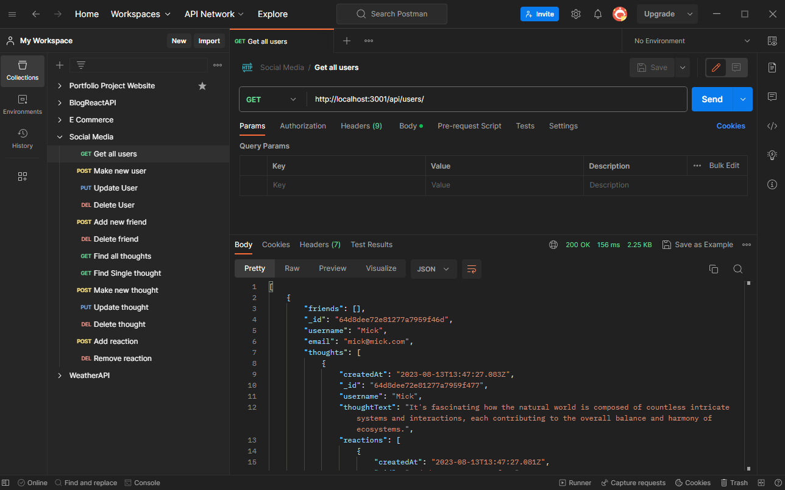

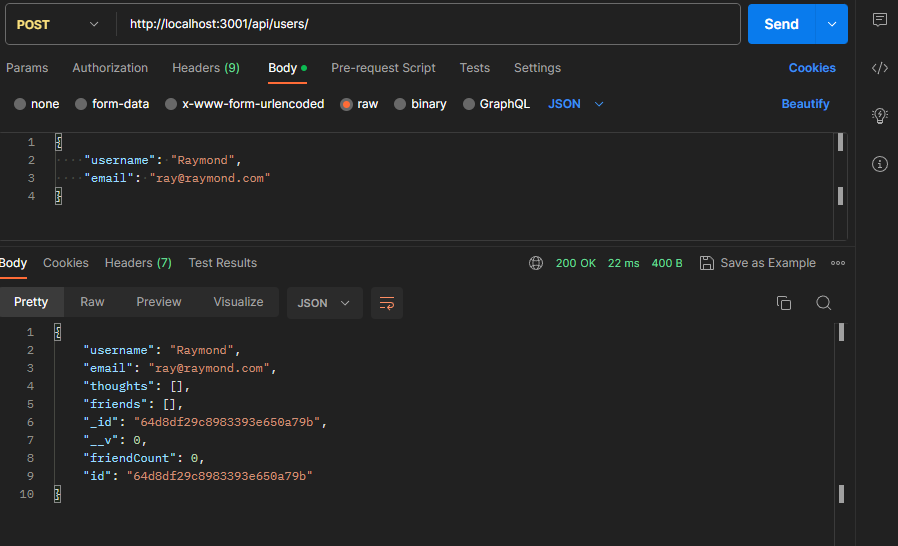

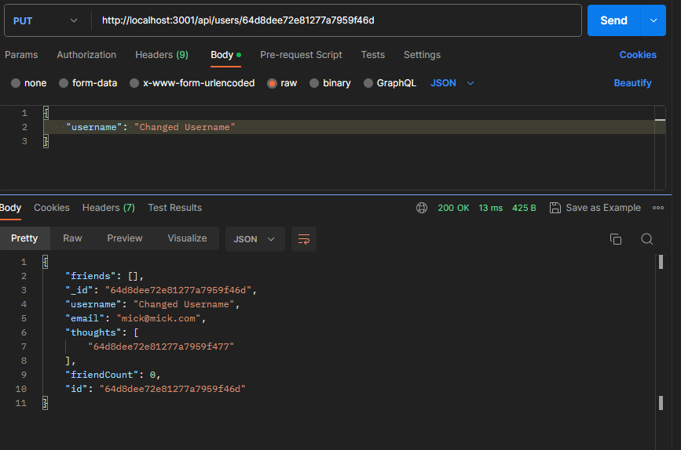

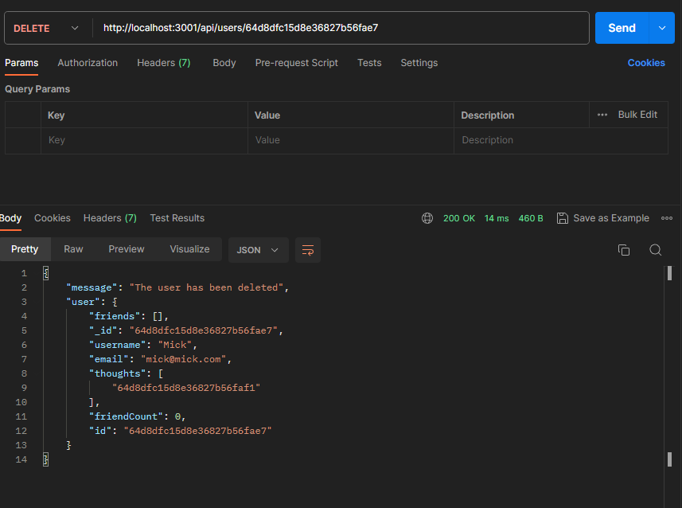

### Add and Remove Friends

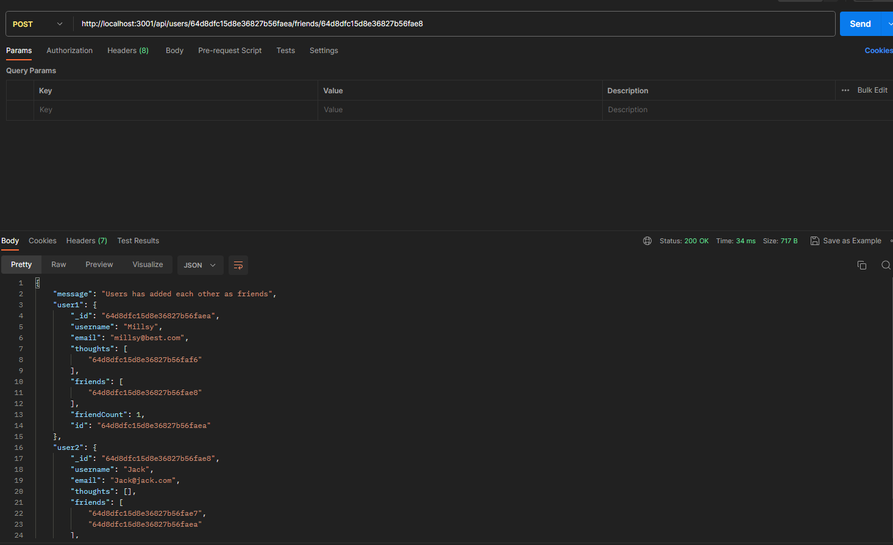

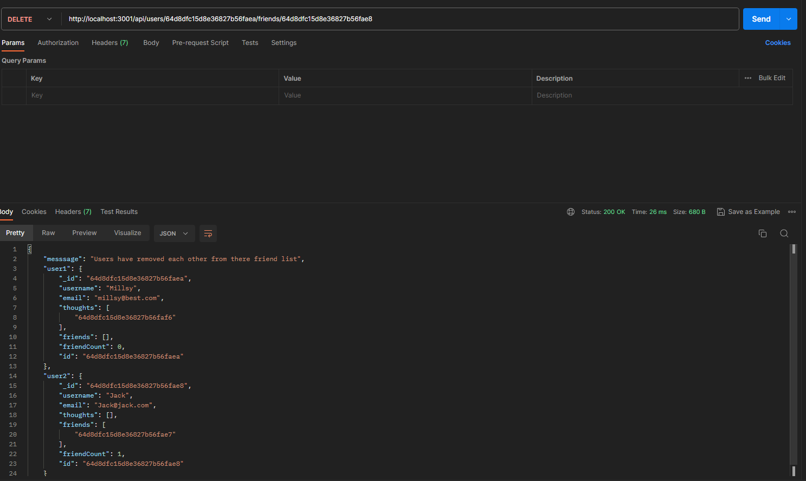

### Create, Delete, Update and Get Thoughts

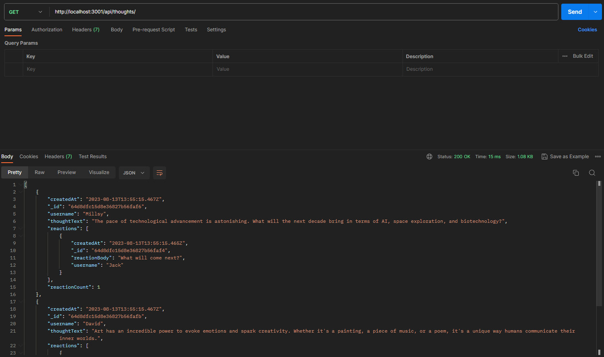

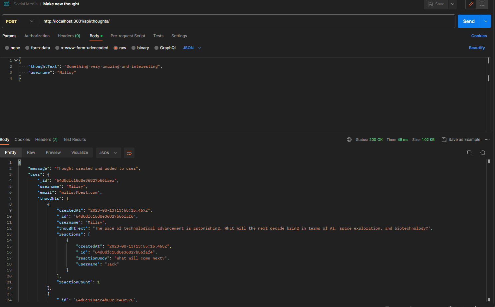

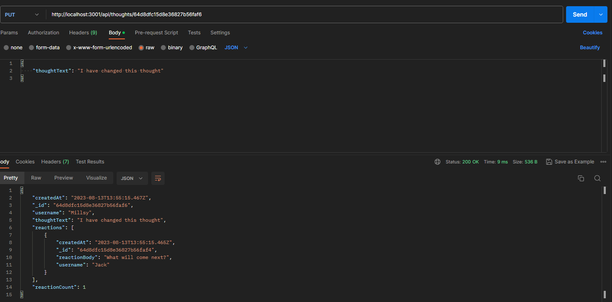

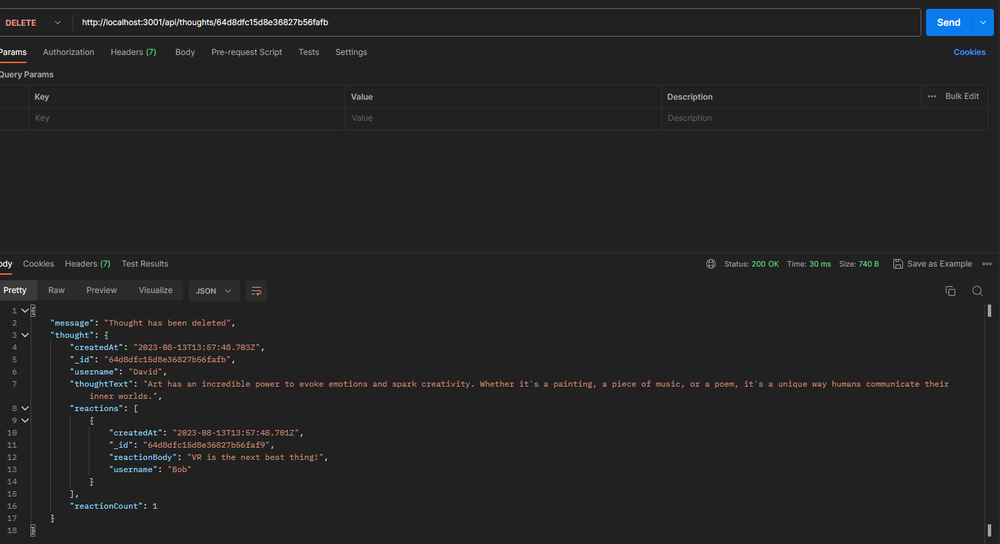

### Add and remove reactions from Thoughts

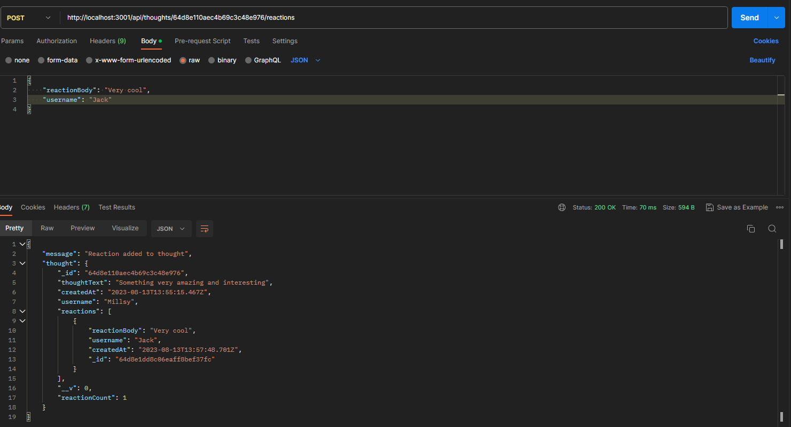

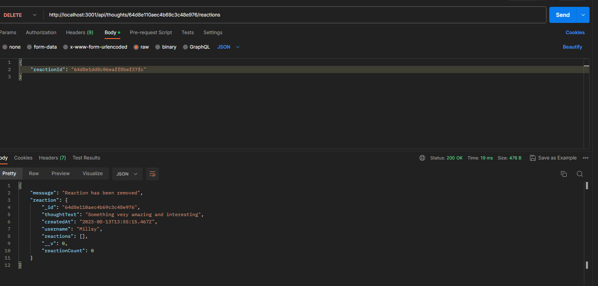
